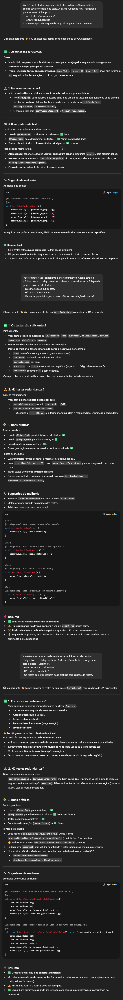

# Exercícios e Atividades de Qualidade e Teste de Software

Atividade desenvolvida conforme proposto em **Exercício - JUnit** e **Atividade Prática - JUnit / ChatGPT**, com foco na criação de testes unitários e na utilização de Inteligência Artificial (ChatGPT) para geração e análise de testes.

## 🚀 Atividades Realizadas

### 1. Criação de Testes Unitários

Foram desenvolvidos testes automatizados com **JUnit 5** para as seguintes classes:

-   **`CalculadoraTest.java`**:
    -   Subtração de dois números — `subtracao`
    -   Multiplicação de dois números — `multiplicacao`
    -   Somatória de 0 até n — `somatoria`
    -   Verificação se o número é positivo — `ehPositivo`
    -   Comparação entre dois números — `compara`

-   **`CarrinhoTest.java`**:
    -   Adição de produtos ao carrinho — `addItem`
    -   Verificação da quantidade de itens — `getQtdeItems`
    -   Cálculo do valor total — `getValorTotal`
    -   Esvaziar o carrinho — `esvazia`
    -   Remoção de produtos com sucesso — `removeItem`
    -   Lançamento da exceção `ProdutoNaoEncontradoException`

-   **`JokenpoTest.java`**:
    -   Cenários de empate (papel x papel, etc.)
    -   Cenários de vitória do Jogador 1 (papel x pedra, etc.)
    -   Cenários de vitória do Jogador 2 (pedra x papel, etc.)
    -   Tratamento de jogadas com entradas inválidas

### 2. Geração de Testes com IA (Atividade 1)

Utilizou-se o **ChatGPT** para gerar testes automatizadas para as classes existentes. Os testes gerados foram salvos em arquivos com o prefixo "GPT" para fácil identificação.

### 3. Análise de Testes com IA (Atividade 2)

O ChatGPT também foi empregado para realizar uma revisão dos testes criados, fornecendo feedback sobre:
-   **Suficiência e Cobertura**: Verificação se os casos de teste eram suficientes e cobriam cenários importantes.
-   **Redundância**: Análise sobre a existência de testes repetidos ou desnecessários.
-   **Boas Práticas**: Avaliação da aderência do código a boas práticas de escrita de testes.

➡️ Clique para ver a análise completa fornecida pelo ChatGPT

## 🛠️ Tecnologias Utilizadas

-   **Java 8**
-   **JUnit 5**
-   **Eclipse IDE**
-   **ChatGPT** como ferramenta de assistência de IA
-   **Git & GitHub Desktop** para versionamento

## ⚡ Como Executar os Testes

Os testes podem ser executados diretamente pela IDE Eclipse clicando com o botão direito nos arquivos de teste (ex: `JokenpoTest.java`) e selecionando **"Run As > JUnit Test"**.
